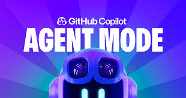

# GitHub Copilot Hands-On: Ft. Agent Mode 

Welcome to the **GitHub Copilot Agent Mode** hands-on workshop, where we code less, vibe more!  
You bring the ideas, and Copilot brings them to life. 

---
## 🛠️ Hands-On: Part 1 - Build Your Dashboard with Copilot Agent Mode

### 🤖 What We'll Build

We’ll design a **dynamic dashboard** to visualize Infineon’s product and sales data (already available in the `data/` folder as a CSV file).

Here’s your mission:
- Explore the data to understand what’s possible.
- Choose your favorite frameworks (Streamlit, Dash, etc.) for building the dashboard. It's your call.
- Share your dashboard vision: describe your idea in words, share a mockup, or even a hand-drawn doodle!
- Let Copilot Agent Mode handle the implementation

---

### 📄 Project Requirements Document (PRD)

You *could* just ask Copilot:  
> "Hey, here’s my data. Can you make some cool visualizations?"

But you often want more control like choosing the framework, setting the layout, or picking a certain style, so it’s best to give Copilot a clear description of what you want.  
That’s where the **Project Requirements Document** (PRD) comes in!

Check out `PRD.md` in this repo. It’s your starting point with info on:
- Framework choices
- Directory structure
- Dashboard component descriptions

By providing a PRD, you empower Copilot (especially in Agent Mode) to build end-to-end applications that match your vision. The more details you give, the better Copilot can deliver exactly what you want.

- The PRD is pre-populated, but there are **TODOs for you to fill in**.
- We’ve provided sample descriptions, but eventually **YOU** decide how your dashboard should look!
- Don’t stop at the PRD. You can also give Copilot some **visual input** to inspire it. This could be:
  - 🎨 A color palette that matches your brand (the Infineon brand palette can be found in the pictures folder)
  - 🖼️ Screenshots of dashboards you love
  - ✏️ A (hand-drawn) doodle that captures your idea?

### Let’s Build Step by Step

1. **Personalize Your PRD:**  
   Open `PRD.md` and fill in the details. Make it as detailed as you want.

2. **Activate Agent Mode:**  
   In Copilot, switch to Agent Mode. Give it your finished PRD and simply ask:  
   > "Please implement this" (we stay polite, right? 😉)

   Most of the instructions are already in your PRD, so you don’t need a fancy prompt.

3. **Watch Agent Mode in Action:**  
   Copilot will build your dashboard. Review what it creates, play around, and don’t be shy to ask for tweaks or changes until it’s just right!

4. **Show Off Your Work:**  
   Once you’re happy, launch your dashboard and share it with the group!

---

### 🤖 Copilot Modes Explained

| Mode        | Who’s in Control? | What Can Copilot Do? |
|-------------|-------------------|----------------------|
| **Ask**     | You               | Copilot suggests, you decide what to apply. No code changes unless you act. |
| **Edit**    | You (with help)   | Copilot edits your code inline, shows a diff, but you approve every change. Only affects files you specify. |
| **Agent**   | Copilot (with your approval) | Copilot can create, edit, delete files across the workspace, run terminal commands, and more. You approve actions step-by-step or at the end. |

> **Agent Mode** is like having a supercharged AI teammate. You just need to guide it a bit!

---

## 🛠️ Hands-On: Part 2 - MCP with Agent Mode

In this part, we’ll explore how to use **Model Context Protocol (MCP)** to extend the capabilities of Copilot's Agent Mode. 

### What is MCP?

Model Context Protocol (MCP) is an open standard that defines how applications share context with large language models (LLMs). It provides a standardized way to connect AI models to different data sources and tools, enabling them to work together more effectively.

Think of it as the "USB-C of AI apps": a universal connector that allows AI models to integrate with various systems. Learn more here: [Model Context Protocol](https://docs.github.com/en/copilot/customizing-copilot/extending-copilot-chat-with-mcp?tool=vscode)

### MCP Servers: Connecting Copilot to Your World

MCP servers act as bridges between AI models and external data sources or tools. They expose functionalities (called "tools") that AI agents can invoke. Thanks to the MCP standard, a growing number of leading platforms and technologies, including GitHub, databases, cloud services and more, now offer their own MCP servers. Some examples include:
- **GitHub MCP Server:** Provides access to GitHub data like issues and pull requests.
- **Postgres MCP Server:** Connects to a PostgreSQL database, allowing AI models to query and interact with structured data stored in Postgres.
- **Custom Servers:** Developers can create custom MCP servers to connect proprietary systems or specialized data sources to AI models.

You can browse a growing list of available MCP servers at [mcp.so](https://mcp.so). Note that while some servers are officially managed, others are community-driven or experimental.

### Hands-On: Implementing GitHub Issues with MCP

In this exercise, we'll use the GitHub MCP Server to retrieve issues from our repository and have Copilot's Agent Mode implement one of them.

> **Note:** You can run an MCP server locally (using Docker, stdio, or npm) or connect to a remote one. Local setup requires a GitHub token and some configuration. For this workshop, we’ll use a pre-configured remote endpoint for a GitHub MCP Server.

### Let’s Explore Step by Step
1. **Add the MCP Server in VS Code:**
   - Open the Command Palette (`Ctrl+Shift+P` or `Cmd+Shift+P`).
   - Type and select "MCP: Add Server".
   - Choose **HTTP** as the server type.
   - Enter the GitHub MCP Server endpoint (provided during the workshop).
   - Optionally, name your server (e.g., "GitHub MCP Server").
   - Save the server to your user or workspace settings.
2. **Start the MCP Server:**
   - In the MCP server settings, click **Start**.
   - Confirm the server status shows as running.
3. **Ask Questions in Agent Mode:**
   - Switch to Agent Mode in Copilot.
   - Ask questions or request actions related to GitHub, like:
   > "Can you list all open issues in this repository?"

   *Hint: For the agent to construct the correct tool call, give it the repository url or owner name*
4. **Implement an Issue:**
   - Copilot will respond with a list of open issues.
   - Choose one to implement, for example:
     > "Please implement the issue #123 'Add a new feature X to the dashboard'"

## 🎉 Wrap-Up

**Congratulations!**

You’ve successfully built a dynamic dashboard using Copilot Agent Mode and discovered how MCP extends Copilot’s reach to external tools and data sources. Keep exploring! There is so much more you can do with Copilot Agent Mode and MCP.

